## 强化学习笔记

#### 基本概念

智能体采取的动作应该是由随机采样得到的，这样不容易被预测

智能体策略是一个概率密度函数(根据动作的取值可以是离散或连续)，如果智能体只输出一种类型的动作则概率密度$P(A|S)$相当于$P(S,A)$--一个二维函数被切了一刀得到的线函数

设计的奖励要有区分度(如移动过程中奖励和游戏回合结束奖励要有明显区分度)

状态转移/状态转移函数：在s执行动作a后得到的动作可能不是确定的，环境的随机性可能也会影响下一时刻状态，即$p(s^{'}|s,a) = \mathbb{P}(S^{'}=s^{'}|S=s,A=a)$ 状态转移是由环境决定的

强化学习随机性来源：动作的随机和状态转移的随机

> $\mathbb{P}[A=a|S=s]=\pi(a|s)$
>
> $\mathbb{P}[S^{'}=s^{'}|S=s,A=a]=p(s^{'}|s,a)$

几个重要概念：return(累计回报), reward(奖励), Action-Value Function: Q(s, a)(动作价值函数)，State-Value Function: V(s)(状态价值函数)

return = $R_t + \gamma R_{t+1} + \gamma ^{2}R_{t+2}+...$         $\gamma \in [0,1]$  既与动作函数有关也与状态转移函数有关，依赖于$A_t, A_{t+1}, A_{t+2}...$和$S_{t+1}, S_{t+2},...$

**$Q_\pi(s,a)$用于评价该策略下当前状态各个动作值的好坏**

$Q_\pi(s_t,a_t) = \mathbb{E}[U_t|S_t=s_t,A_t=a_t]$ 为策略$\pi$下在$s_t$状态执行$a_t$这个动作的好坏

$Q^*(s_t,a_t)=\underset{\pi}{max}Q_\pi(s_t,a_t)$ 用所有策略中最大的Q值作为动作值

**$V_\pi(s_t)$用于评价该策略下当前状态的好坏**

$V_\pi(s_t)=\mathbb{E}_A[Q_\pi(s_t,A)]=\sum_a\pi(a|s_t)*Q_\pi(s_t,a)$  离散动作的情况

$V_\pi(s_t)=\mathbb{E}_A[Q_\pi(s_t,A)]=\int\pi(a|s_t)*Q_\pi(s_t,a)da$   连续动作的情况

**$E_S[V_\pi(S)]$可用于评价当前策略的好坏**

训练智能体的两种方式：得到好的策略函数$\pi(a|s)$--连续动作 或是好的值函数$Q^*(s,a)$--离散动作，但是不局限于连续和离散动作

---

#### 价值学习

价值学习希望学习到一个$Q^*(s,a)$，能够估计当前状态每个动作的最大回报

方法：使用神经网络$Q(s,a;\bf{w})$近似$Q^*(s,a)$

Temporal Difference Learning: 由于当前估计的target包含事实成分，故更加可信，能够被用来更新模型，可以不完成整个回合就能更新模型

>TD公式可以理解为： $T_{NYC \to ATL}(模型直接估计值) \approx T_{NYC \to DC}(真实值) + T_{DC \to ATL}(模型直接估计值)$
>
>在模型中：
>
>$Q(s_t,a_t;\bf{w})(模型直接估计值) \approx r_t(真实值) + \gamma \cdot Q(s_{t+1},a_{t+1};\bf{w})(模型直接估计值)$
>
>​                                                       $\approx r_t + \gamma \cdot \underset{a}{max}Q(s_{t+1},a;w_t)$ 

#### 策略学习

价值学习中并没有学习策略函数，即DQN中学习到的是估值函数

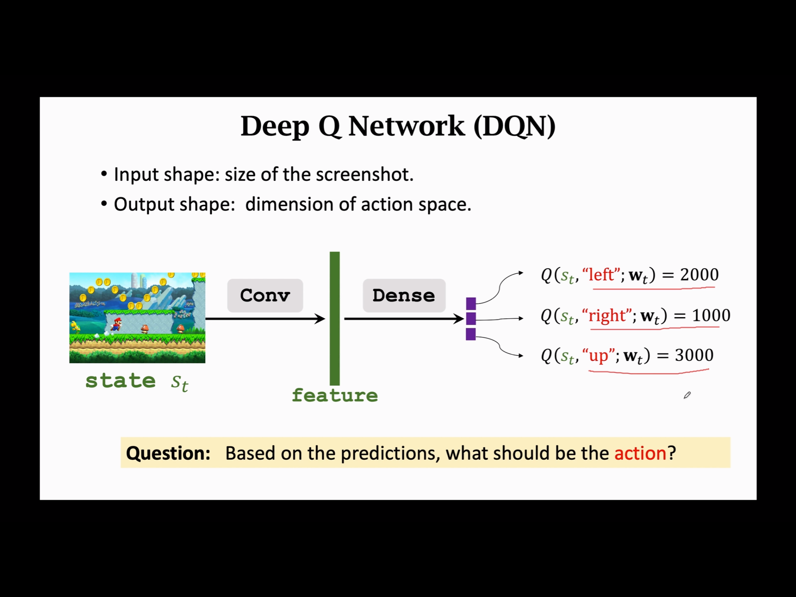

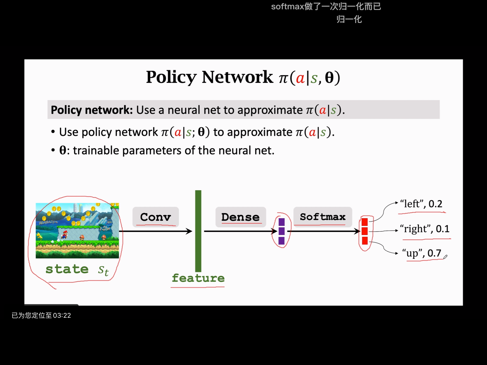

上面两幅图可以看出策略函数只是在神经网络输出后加了一个softmax层对动作取概率

$V(s;\bf{\theta})=\sum_a\pi(a|s_t;\bf{\theta})*Q_\pi(s_t,a)$

策略学习的目的在于学习$\theta$去最大化$J(\bf{\theta}) = \mathbb{E}_s[V(S;\theta)]$   求能够让状态S期望最大的$\theta$

更新$\theta$的方式：$\theta \gets \theta + \beta \cdot \frac{\partial V(s;\theta)}{\partial \theta}$  这里采用单个状态$V(s;\theta)$的目的是为了方便更新进行梯度上升

这里假设$Q_\pi(s,a)$与$\theta$无关，但其实是有关的，方便推导$\frac{\partial V(s;\theta)}{\partial \theta}$

$\begin{aligned} \frac{\partial V(s ; \boldsymbol{\theta})}{\partial \boldsymbol{\theta}} &=\sum_a \frac{\partial \pi(a \mid s ; \boldsymbol{\theta})}{\partial \boldsymbol{\theta}} \cdot Q_\pi(s, a)    (针对离散动作采用该公式)\\ &=\sum_a \pi(a \mid s ; \boldsymbol{\theta}) \cdot \frac{\partial \log \pi(a \mid s ; \boldsymbol{\theta})}{\partial \boldsymbol{\theta}} \cdot Q_\pi(s, a) \\ &=\mathbb{E}_A\left[\frac{\partial \log \pi(A \mid s ; \boldsymbol{\theta})}{\partial \boldsymbol{\theta}} \cdot Q_\pi(s, A)\right]    (针对连续动作采用该公式) \end{aligned}    $

离散动作可以直接代入公式求得梯度

连续动作求梯度需要：

1. 从策略函数中$\pi(\cdot|s;\bf\theta)$随机采样一个动作$\hat{a}$
2. 计算$\mathbf{g}(\hat{a}, \boldsymbol{\theta})=\frac{\partial \log \pi(\hat{a} \mid s ; \boldsymbol{\theta})}{\partial \boldsymbol{\theta}} \cdot Q_\pi(s, \hat{a})$
3. 因为$E(\bf{g}(\hat{a},\theta))=\frac{\partial V(s;\theta)}{\partial \theta}$，因此$\bf{g}(\hat{a},\theta)$是$\frac{\partial V(s;\theta)}{\partial \theta}$的无偏估计，用$\bf{g}(\hat{a},\theta)$的值代替$\frac{\partial V(s;\theta)}{\partial \theta}$ 该策略也可用于离散动作

连续动作中如何求$Q_\pi(s_t,a_t)$?

- REINFORCE(回合结束后结算)

  每回合结束后得到一系列轨迹$s_1,a_1,r_1,s_2,a_2,r_2,...,s_T,a_T,r_T$

  $u_t=\sum_{k=t}^{T}\gamma^{k-t}r_k$是对$U_t$的观测值，又因为$\mathbb{E}[U_t]=Q_\pi(s_t,a_t)$，因此$U_t$是对应的无偏估计，$u_t=Q_\pi(s, \hat{a})$

- 使用神经网络近似$Q_\pi(s_t,a_t)$$\to$Actor Critic算法

---

#### Actor-Critic

$V_\pi(s)=\sum_a \pi(a \mid s) \cdot Q_\pi(s, a) \approx \sum_a \pi(a \mid s ; \boldsymbol{\theta}) \cdot q(s, a ; \mathbf{w})$ 这里采用两个神经网络分别近似策略函数和评价函数

策略函数：

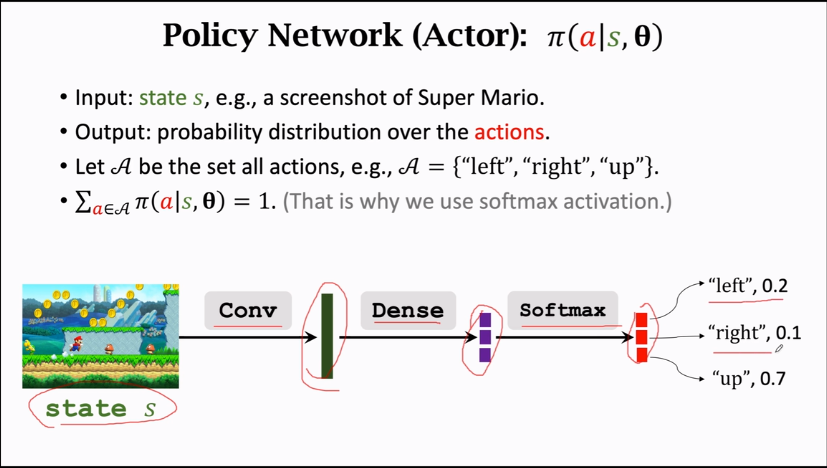

价值函数：

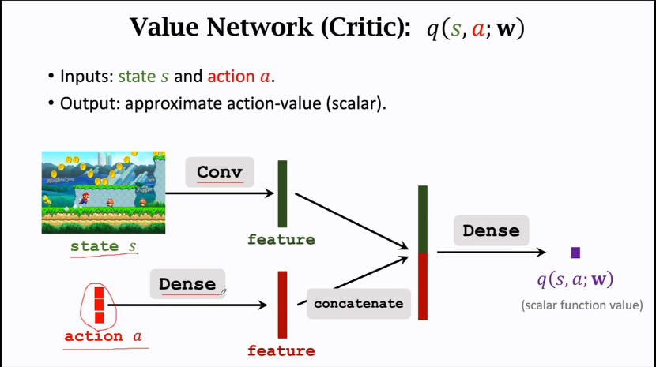

价值函数的输入action如果是离散的可以用one-hot向量表示

Actor-Critic的作用：使Actor做出尽可能好的动作以提高状态价值函数的整体估值并且使Critic的打分更加精准

**训练方法：通过TD算法更新评价网络的参数$\omega$ 通过策略梯度的方法更新策略函数的参数$\theta$**

价值网络更新：

1. 计算$q(s_t,a_t;w_t)$和$q(s_{t+1},a_{t+1};w_t)$，这里的$a_t和a_{t+1}$都是从策略中随机抽样得到的
2. TD target: $r_t+\gamma \cdot q\left(s_{t+1}, a_{t+1} ; \mathbf{w}_t\right)$
3. 损失：$\left.L(\mathbf{w})=\frac{1}{2}\left[q\left(s_t\right., a_t ; \mathbf{w}\right)-y_t\right]^2$
4. 梯度下降：$\mathbf{w}_{t+1}=\mathbf{w}_t-\left.\alpha \cdot \frac{\partial L(\mathbf{w})}{\partial \mathbf{w}}\right|_{\mathbf{w}=\mathbf{w}_t}$

注意使用策略梯度更新策略网络时，以下两种方式都可以：

- $\theta_{t+1}=\theta_t+\beta \cdot q_t \cdot d_{\theta,t}$

- $\theta_{t+1}=\theta_t+\beta \cdot \delta_t \cdot d_{\theta,t}$  ,$\delta_t=q_t-(r_t+\gamma \cdot q_{t+1})$(这是评价网络中的TD误差)

  使用$q_t$是标准算法，使用$\delta_t$是policy gradient with baseline，使用$\delta_t$效果更好，因为方差更小算法收敛更快

  什么是baseline？: 任何接近$q_t$的数都可以作为baseline，但这个baseline不能是动作$a_t$的函数
  
  用于计算$q_{t+1}$的$a_{t+1}$是随机抽样得到的

Actor-Critic最终的目的是为了学习一个好的策略网络，训练结束后就不需要Critic网络

---

#### AlphaGo 

强化学习与模仿学习的本质区别在于：有无奖励

模仿学习的缺陷在于面对未知环境难以做出好的动作

AlphaGo训练方法： behavior learning $\to$ policy network $\to$ value network(这里是状态价值函数$V_\pi(s)$而不是动作价值函数$Q(s,a)$) $\to$  Monte Carlo Tree Search  $\to$ decision 

先训练了策略网络，才开始训练价值网络，训练价值网络的第一步需要用策略网络进行自我博弈

蒙特卡洛树搜索(MCTS)：

- Selection: 对动作的选取根据$\operatorname{score}(a)=Q(a)+\eta \cdot \frac{\pi\left(a \mid s_t ; \boldsymbol{\theta}\right)}{1+N(a)}$，a的打分最初依偏重于策略函数，之后偏重于$Q(a)$
- Expansion: 模拟执行完自己的一步之后对手依据自己的策略函数选取动作然后进入下一状态
- Evaluation: 自己和对手循环下棋直到结束拿到奖励，然后对$s_{t+1}$进行评价，$V(s_{t+1})=\frac{1}{2}v(s_{t+1};w)+\frac{1}{2}r_t$
- Backup: 每执行一个$a_t$前进行模拟，得到若干$V(s_{t+1})$，$Q(a_t)$是对所有的$V(s_{t+1})$求平均，并用于Selection中

决策时选取的$a_t=\underset{a}{argmax}N(a)$，即下一步采用被选取最多次的动作

AlphaGo Zero把蒙特卡洛树搜索放到了训练中：

- 策略网络预测：

  $\mathbf{p}=\left[\pi\left(a=1 \mid s_t ; \boldsymbol{\theta}\right), \cdots, \pi\left(a=361 \mid s_t ; \boldsymbol{\theta}\right)\right] \in \mathbb{R}^{361}$

- MCTS预测：

  $\mathbf{n}=$ normalize $[N(a=1), N(a=2), \cdots, N(a=361)] \in \mathbb{R}^{361}$

目的是为了让策略网络预测逼近MCTS预测

---

#### 蒙特卡洛+Monte+Carlo

蒙特卡洛方法的作用在于利用样本近似期望，根据大数定律，估计的期望的精度反比于$\sqrt{n}$ 

- 蒙特卡洛方法可用来估计积分$I=\int_\Omega f(x)dx$的数值解：
  1. 随机均匀采样$x_1,...x_n$
  2. 计算$V=\int_\Omega dx$
  3. 数值估计$$Q_n=V \cdot \frac{1}{n} \sum_{i=1}^n f\left(\mathbf{x}_i\right)$$
  4. $I=Q_n$

- 蒙特卡洛方法可用来估计随机变量X的数学期望$\mathbb{E}_{X\sim p[f(X)]}=\int_{\mathbb{R^d}}f(x)\cdot p(x)dx$
  1. 这里不是进行随机均匀抽样，而是根据随机变量的概率密度函数$p(x)$进行抽样，得到$x_1,...,x_n$
  2. 计算期望估计$Q_n=\frac{1}{n}\sum_{i=1}^nf(x_i)$
  3. $\mathbb{E}_{X\sim p[f(X)]}=Q_n$

---

#### Sarsa($s_t,a_t,r_t,s_{t+1},a_{t+1}$，其目标是学习$Q_\pi$)

$R_t$依赖于$(S_t,A_t,S_{t+1})$，这里依赖于下一时刻状态是因为状态转移函数可能会导致下一状态是不确定的

$\begin{aligned} Q_\pi\left(s_t, a_t\right) &=\mathbb{E}\left[U_t \mid s_t, a_t\right] \\ &=\mathbb{E}\left[R_t+\gamma \cdot U_{t+1} \mid s_t, a_t\right] \\ &=\mathbb{E}\left[R_t \mid s_t, a_t\right]+\gamma \mathbb{E}\left[U_{t+1} \mid s_t, a_t\right] \\ &=\mathbb{E}\left[R_t \mid s_t, a_t\right]+\gamma \cdot \mathbb{E}\left[Q_\pi\left(S_{t+1}, A_{t+1}\right) \mid s_t, a_t\right] \end{aligned}$

$\mathbb{E}[U_{t+1}|s_t,a_t]=\mathbb{E}[Q_\pi(S_{t+1},A_{t+1})|s_t,a_t]$是因为$\mathbb{E}[U_{t+1}|s_t,a_t]=Q_\pi(S_{t+1},A_{t+1})$，并且$E(常数)=常数$，这里是大写$(S_{t+1},A_{t+1})$的原因在于下一状态的s和a是不确定的

故$Q_\pi\left(s_t, a_t\right)=\mathbb{E}\left[R_t+\gamma \cdot Q_\pi\left(S_{t+1}, A_{t+1}\right)\right]$     for all $\pi$  后者是前者的无偏估计

针对Sarsa算法：

$TD \ traget:\ y_t=r_t + \gamma \cdot Q_\pi(s_{t+1},a_{t+1})$  注意这里的$a_{t+1}是通过在s_{t+1}采样得到的$随机动作

$TD\ error:\ \delta_t=Q_\pi(s_t,a_t)-y_t$

$Q_\pi(s_t,a_t) \gets Q_\pi(s_t,a_t)-\alpha\delta_t$

---

#### Q-Learning(目标是学习最优动作价值函数$Q^*$)

虽然sarsa与Q-Learning都是采用TD更新，但sarsa对应$Q_\pi(s,a)$，Q-Learning对应$Q^*(s_{t+1},a)$

- 针对sarsa: $y_t=r_t + \gamma \cdot Q_\pi(s_{t+1},a_{t+1})$
- 针对Q-Learning: $y_t=r_t+\gamma \cdot \underset{a}{max}Q^*(s_{t+1},a)$

$TD\ target:\ y_t=r_t+\gamma \cdot \max _a Q^{\star}\left(s_{t+1}, a\right)$

$TD\ error:\ \delta_t=Q^{\star}\left(s_t, a_t\right)-y_t$

$Q^{\star}\left(s_t, a_t\right) \leftarrow Q^{\star}\left(s_t, a_t\right)-\alpha \cdot \delta_t$

DQN近似的是$Q^*(s,a)$，选择的动作$a_t=\underset{a}{argmax}Q(s_t,a;w)$

---

#### Multi-Step TD Target

sarsa和Q-learning的奖励$r_t$来源于单步，把$r_t$的来源扩展到多步可以获得更好的效果

- 针对sarsa的多步TD Target公式：

  $y_t=\sum_{i=0}^{m-1} \gamma^i \cdot r_{t+i}+\gamma^m \cdot Q_\pi\left(s_{t+m}, a_{t+m}\right)$

- 针对Q-learning的多步TD Target公式:

  $y_t=\sum_{i=0}^{m-1} \gamma^i \cdot r_{t+i}+\gamma^m \cdot \underset{a}{max} Q^{\star}\left(s_{t+m}, a\right)$

---

#### Experience Replay

 解决的问题:

- 浪费经验

  因为每次使用四元组$(s_t,a_t,r_t,s_{t+1})$更新后会把它丢弃

- transition之间的相关性

  四元组$(s_t,a_t,r_t,s_{t+1})$中如果$s_t和s_{t+1}$具有很强的相关性是不好的，如果消除相关性有利于把DQN训练的更好

使用经验回放，从中抽取1个或者mini_batch个transition，然后通过TD error求梯度或平均梯度对整个网络参数$w$进行更新

好处：打破了经验的相关性和重复利用经验

**优先经验回放：使用重要性采样/非均匀采样代替均匀采样**

- 方法1：

  采样概率$\ p_t\ \alpha\ |\delta_t|+\epsilon\ \ \ \epsilon是一个很小的数以保证概率不为0$

- 方法2：

  采样概率$\ p_t\ \alpha\ \frac{1}{rank(t)}$

总结：TD error越大，该transition被选中的概率越高

优先经验回放中不同transition选取的概率不同，因此不同transition的学习率不同，学习率$\alpha$应该乘上$(np_t)^{-\beta},\ \ \beta\in(0,1)$，$\beta$应从很小的值增长到1

使用方法：做优先经验回放需要给每个transition标记上TD error，即$\delta _t$，如果一条经验还没被使用，即没有TD error，需要将它设为最高优先级，每次选取了一个transition后都更新它的$\delta _t$

---

#### Target Network & Double DQN

数学原理：向$x_1,...,x_n$中添加均值为0的随机噪声得到$Q_1,...,Q_n$会导致期望不变，上下限得到扩展，即：

$\mathbb{E}\left[\operatorname{mean}_i\left(Q_i\right)\right]=\operatorname{mean}_i\left(x_i\right)$

$\mathbb{E}\left[\max _i\left(Q_i\right)\right] \geq \max _i\left(x_i\right)$

$\mathbb{E}\left[\min _i\left(Q_i\right)\right] \leq \min _i\left(x_i\right)$

TD学习会使DQN高估动作价值：

- 最大化操作：$y_t=r_t+\gamma \cdot \max _a Q\left(s_{t+1}, a ; \mathbf{w}\right)$，导致TD target高于真实动作价值

  - 真实动作价值：$x(a_1),...,x(a_n)$

  - DQN的估计带有误差：$Q(s,a_1;w),...,Q(s,a_n;w)$

  - 假设是无偏估计：

    $\underset{a}{mean}(x(a))=\underset{a}{mean}(Q(s,a;w))$

  - $q=\underset{a}{max}Q(s,a;w)\ge\underset{a}{max}(x(a))$，导致过估计

  - $q_{t+1}是过估计，y_t=r_t+\gamma \cdot q_{t+1}也是过估计，训练会导致q_t过估计$

- 自举(bootstrapping)：用自己的估计再去估计自己，$q_{t+1}$高估在训练过程中不断传播导致DQN网络高估，高估后的值又被传播

均匀高估不会对策略好坏产生影响，但非均匀高估会，DQN是非均匀高估

$(s,a)$在被从回放经验池取得越频繁，就越会导致$Q^*(s,a)$被高估

两种解决高估的方法：

- 使用target network计算TD target，处理自举(bootstrapping)带来的问题，使用$transition(s_t,a_t,r_t,s_{t+1})$更新$w$，尽管效果更好，但也有max带来的高估问题

  - $Q(s,a;w)$用来控制智能体和收集经验，目标网络$Q(s,a;w^-)$用来计算TD target，然后更新$Q(s,a;w)$的参数$w$
  - TD target: $y_t=r_t+\gamma \cdot \underset{a}{max} Q\left(s_{t+1}, a ; \mathbf{w}^{-}\right)$
  - TD error: $\delta_t=Q\left(s_t, a_t ; \mathbf{w}\right)-y_t$
  - 梯度更新：$\mathbf{w} \leftarrow \mathbf{w}-\alpha \cdot \delta_t \cdot \frac{\partial Q\left(s_t, a_t ; \mathbf{w}\right)}{\partial \mathbf{w}}$
  - $w^-$的更新方式有两种：
    1. 周期地 $w^- \gets w$
    2. 周期地 $w^- \gets \tau \cdot w + (1-\tau)\cdot w^-$

- 使用double DQN减轻最大化带来的过估计

  使用训练网络为$s_{t+1}$选择动作：$a^*=\underset{a}{argmax}Q(s_{t+1},a;w)$

  使用目标网络对选取的动作进行评估：$y_t=r_t+\gamma \cdot Q\left(s_{t+1}, a^{\star} ; \mathbf{w}^{-}\right)$

  **Double DQN减轻了过估计：**

  $Q\left(s_{t+1}, a^{\star} ; \mathbf{w}^{-}\right) \leq \underset{a}{max} Q\left(s_{t+1}, a ; \mathbf{w}^{-}\right)$，因为别的网络在$s_{t+1}$选出的动作不会大于该网络在$s_{t+1}$所有动作Q值的最大值

---

#### Dueling Network

最优动作价值函数：

$Q^{\star}(s, a)=\underset{\pi}{max} Q_\pi(s, a)$

最优状态价值函数：

$V^{\star}(s)=\underset{\pi}{max} V_\pi(s)$

优势函数(Optimal advantage function)：

$A^{\star}(s, a)=Q^{\star}(s, a)-V^{\star}(s)$

定理1：$V^*(s)=\underset{a}{max}Q^*(s,a)$，可理解为最优价值函数是先选择最优策略后再选择最优动作

对优势函数两边同时对a取最大值：

得到：$\underset{a}{max}A^*(s,a)=0$

联合优势函数和通过定理1得到的公式，得到定理2：$Q^{\star}(s, a)=V^{\star}(s)+A^{\star}(s, a)-\underset{a}{max} A^{\star}(s, a)$

分别用神经网络$V(s;w^V)$和神经网络$A^*(s,a;w^A)$近似$V^*(s)$和$A^*(s,a)$

$Q\left(s, a ; \mathbf{w}^A, \mathbf{w}^V\right)=V\left(s ; \mathbf{w}^V\right)+A\left(s, a ; \mathbf{w}^A\right)-\underset{a}{max} A\left(s, a ; \mathbf{w}^A\right)$

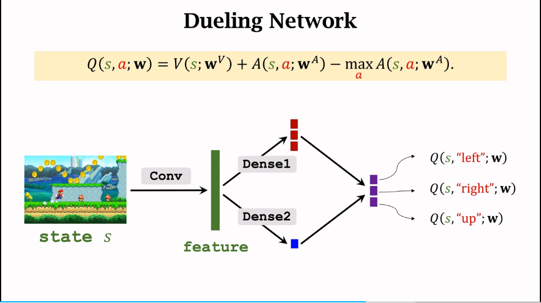

针对以下两个优势函数：

- $Q^{\star}(s, a)=V^{\star}(s)+A^{\star}(s, a)$

- $Q^{\star}(s, a)=V^{\star}(s)+A^{\star}(s, a)-\underset{a}{max} A^{\star}(s, a)$

公式1会面临不唯一性的问题，即V和A如果预测的波动相同，方向相反，尽管$Q^*(s,a)$不变但这会导致两个网络都训练不好，公式2不会面临这个问题

存在以下变体：

$Q(s, a ; \mathbf{w})=V\left(s ; \mathbf{w}^V\right)+A\left(s, a ; \mathbf{w}^A\right)-\underset{\operatorname{a}}{mean} A\left(s, a ; \mathbf{w}^A\right)$       单纯实验效果更好，没有相应推导

Dueling network和DQN的训练方式完全一样，TD算法，不单独训练V和A

---

#### Multi-Agent Reinforcement Learning: Concepts and Challenges

多机的常见设定：

1. 完全合作(Fully cooperative)  (共同目标或共同利益)
2. 完全竞争(Fully competitive)  (零合博弈，获得的奖励总和为0，捕食者和猎物)
3. 合作与竞争混合(Mixed Cooperative & competitive)  (机器人足球)
4. 利己主义(Self-interested)  (股票交易，无人车，不会刻意帮助和损害他人利益)

多智能体中术语：

$A^i$表示第i个智能体的动作

$R^i$表示第i个智能体的回报

$R_t^i$表示第i个智能体在时间t的奖励

- 完全合作：$R^1=R^2=\cdots=R^n$
- 完全竞争：$R^1 \propto-R^2$  

$Return$：$U_t^i=R_t^i+R_{t+1}^i+R_{t+2}^i+R_{t+3}^i+\cdots$

$Discounted return$：$U_t^i=R_t^i+\gamma \cdot R_{t+1}^i+\gamma^2 \cdot R_{t+2}^i+\gamma^3 \cdot R_{t+3}^i+\cdots$

$Policy Network:\ \pi(a^i|s;\theta^i)$

- 有些场景策略网络可以互换，如无人车
- 有些场景策略网络不可互换，如足球机器人

状态转移:

$p(s^{\prime} \mid s,a^1, \cdots, a^n)=\mathbb{P}\left(S^{\prime}=s^{\prime} \mid S=s, A^1=a^1, \cdots, A^n=a^n\right).$

第i个智能体的状态值：

$V^i\left(s_t ; \boldsymbol{\theta}^1, \cdots, \boldsymbol{\theta}^n\right)=\mathbb{E}\left[U_t^i \mid S_t=s_t\right]$，依赖于所有智能体的网络参数是因为后续return与所有智能体在t+1时刻的所有动作有关

针对单智能体策略学习：

- 策略网络：$\pi(a|s;\theta)$
- 状态值函数：$V(s;\theta)$
- $J(\theta)=\mathbb{E}_s[V(S;\theta)]$用于评估策略
- 通过$\underset{\theta}{max}J(\theta)$学习策略网络参数$\theta$
- 判断是否收敛：$J(\theta)$是否停止增长

使用单智能体策略学习针对多智能体策略学习：   (这种方式不可行)

- 第i个智能体策略网络：$\pi(a^i|s;\theta^i)$
- 第i个智能体状态价值函数：$V^i(s;\theta^1,...,\theta^n)$
- 目标函数$J^i(\theta^1,...,\theta^n)=\mathbb{E}_s[V^i(S;\theta^1,...,\theta^n)]$
- 每个智能体学习$\theta^i$以最大化$\underset{\theta^i}{max}J^i(\theta^1,...,\theta^n)$

##### 纳什均衡/多智能体收敛：保持其他智能体策略不变，一个智能体策略变化不会导致它获得更好的期望回报

---

多智能体架构(多机之间建立通信了解其他智能体的动作和策略有利于训练)：

- 完全独立(Fully Decentralized)，每个智能体只使用自己的观测和奖励学习自己的策略，智能体之间不进行通信

  *使用Actor-critic方法，更新方法与Actor-critic更新方法一致*

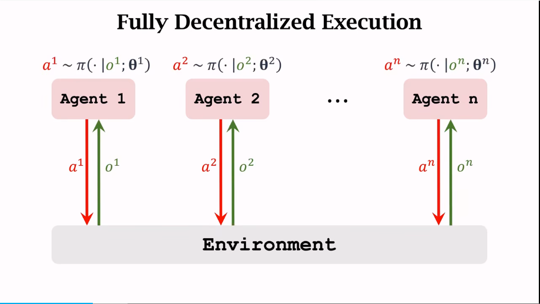

- 完全中心化(Fully centralized)，智能体把所有信息给中央控制器，中央控制器为每个智能体做决策

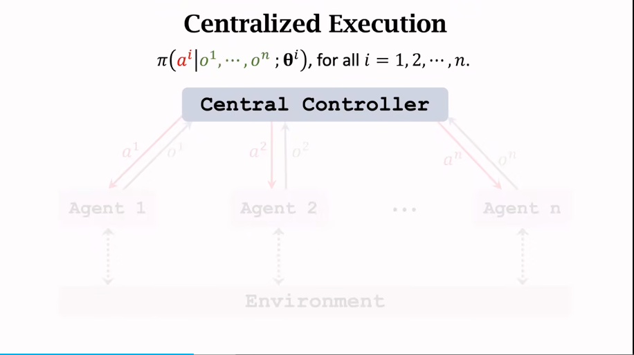

这里中央控制器是由很多个agent的策略网络和价值网络组成的(Actor-Critic)，所有机器人动作的动作组$a=[a^1,a^2,...,a^n]$，所有机器人观测的观测组$o=[o^1,o^2,...,o^n]$

中央控制器包含策略网络和价值网络：

第i个智能体策略网络：$\pi(a^i|o;\theta^i)$   策略网络基于观测组做动作

第i个智能体价值网络：$q(o,a;w^i)$    价值网络基于观测组和动作组打分

训练时采用Actor-Critic的训练方法，执行时需要基于观测组o，$a^i \sim \pi(\cdot|o;\theta^i)$，并将动作给第i个agent

**缺陷：所有智能体需要把观测发给中央控制器，通信和信息同步需要时间导致整个系统的实时性很低**

- 中心化训练去中心化执行(Centralized training with decentralized execution)，中央控制器在训练价值网络时被使用，在训练结束后执行时不使用

  策略网络：$\pi(a^i|o^i;\theta^i)$      agent只依赖于自己的局部观测做出动作，因此可以在本地训练

  价值网络：$q(o,a;w^i)$        这里需要全局信息，需要在中央控制器训练

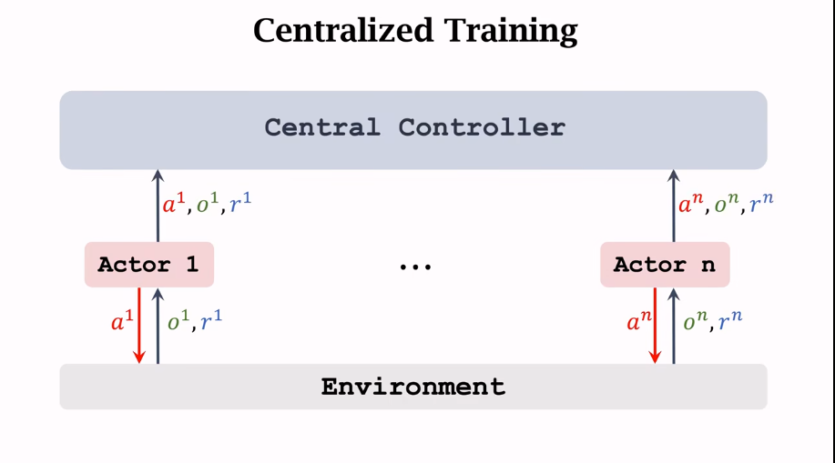

多智能体强化学习是在不完全观测下的，即不知道全局状态s，$o^i$是第i个智能体观测，

不完全观测情况：$o^i\ne s$

完全观测情况：$o^1=...=o^n=s$

**网络应该共享参数吗？**(取决于应用场景)

- 针对智能体不可互换的场景    ---不可以
- 针对智能体可互换的场景    --可以

多智能体几种架构的对比：

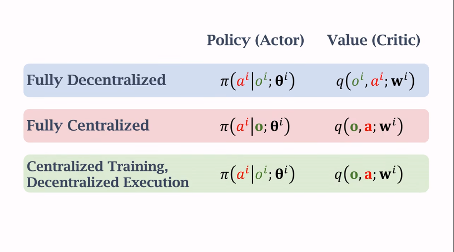

---

#### Policy Gradient with Baseline

策略梯度采用baseline降低方差，加快收敛

**假设b是不依赖A的变量，$\mathbb{E}_{A \sim \pi}\left[b \cdot \frac{\partial \ln \pi(A \mid s ; \boldsymbol{\theta})}{\partial \boldsymbol{\theta}}\right]=0$，证明得到策略梯度：**
$$
\begin{aligned}
\mathbb{E}_{A \sim \pi}\left[b \cdot \frac{\partial \ln \pi(A \mid s ; \boldsymbol{\theta})}{\partial \boldsymbol{\theta}}\right] &=b \cdot \mathbb{E}_{A \sim \pi}\left[\frac{\partial \ln \pi(A \mid s ; \boldsymbol{\theta})}{\partial \boldsymbol{\theta}}\right] \\
&=b \cdot \sum_a \pi(a \mid s ; \boldsymbol{\theta}) \cdot\left[\frac{1}{\pi(a \mid s ; \boldsymbol{\theta})} \cdot \frac{\partial \pi(a \mid s ; \boldsymbol{\theta})}{\partial \boldsymbol{\theta}}\right] \\
&=b \cdot \sum_a \frac{\partial \pi(a \mid s ; \boldsymbol{\theta})}{\partial \boldsymbol{\theta}} \\
&=b \cdot \frac{\partial \sum_a \pi(a \mid s ; \boldsymbol{\theta})}{\partial \boldsymbol{\theta}} \\
&=b \cdot \frac{\partial 1}{\partial \boldsymbol{\theta}}=0
\end{aligned}
$$
策略梯度：
$$
\frac{\partial V_\pi(s)}{\partial \theta}=\mathbb{E}_{A \sim \pi}\left[\frac{\partial \ln \pi(A \mid s ; \boldsymbol{\theta})}{\partial \boldsymbol{\theta}}, Q_\pi(s, A)\right]-\mathbb{E}_{A \sim \pi}\left[\frac{\partial \ln \pi(A \mid s ; \boldsymbol{\theta})}{\partial \boldsymbol{\theta}} b\right]\\=\mathbb{E}_{A \sim \pi}\left[\frac{\partial \ln \pi(A \mid s ; \boldsymbol{\theta})}{\partial \boldsymbol{\theta}}\left(Q_\pi(s, A)-b\right)\right]
$$
虽然添加$\mathbb{E}_{A \sim \pi}\left[b \cdot \frac{\partial \ln \pi(A \mid s ; \boldsymbol{\theta})}{\partial \boldsymbol{\theta}}\right]$没有改变$\frac{\partial V_\pi(s)}{\partial \theta}$的期望，但是改变了方差，如果b的值与$Q_\pi(s,a)$足够接近，方差小收敛快

若b与$A_t$无关，每一时间步的梯度：

$\frac{\partial V_\pi\left(s_t\right)}{\partial \boldsymbol{\theta}}=\mathbb{E}_{A_t \sim \pi}\left[\frac{\partial \ln \pi\left(A_t \mid s_t ; \boldsymbol{\theta}\right)}{\partial \boldsymbol{\theta}} \cdot\left(Q_\pi\left(s_t, A_t\right)-b\right)\right]$

b可以取$V_\pi(s_t)$，因为它接近于$Q_\pi(s_t,A_t)$但又与$A_t$无关

---

#### REINFORCE with Baseline

$Q_\pi\left(s_t, a_t\right)=\mathbb{E}\left[U_t \mid s_t, a_t\right]$

$\frac{\partial V_\pi\left(s_t\right)}{\partial \boldsymbol{\theta}}=\mathbb{E}_{A_t \sim \pi}\left[\frac{\partial \ln \pi\left(A_t \mid s_t ; \boldsymbol{\theta}\right)}{\partial \boldsymbol{\theta}} \cdot\left(Q_\pi\left(s_t, A_t\right)-V_\pi(s_t)\right)\right]$

*注意$\left(Q_\pi\left(s_t, A_t\right)-V_\pi(s_t)\right)$是个优势函数*

因此$u_t$是$Q_\pi(s_t,a_t)$的无偏估计，可用来近似$Q_\pi(s_t,a_t)$   (REINFORCE)方法：

- 观测轨迹：$s_t, a_t, r_t, s_{t+1}, a_{t+1}, r_{t+1}, \cdots, s_n, a_n, r_n$
- 计算return：$u_t=\sum_{i=t}^n\gamma^{i-t}\cdot r_i$
- $u_t$是$Q_\pi(s_t,a_t)$的无偏估计

$V_\pi(s_t)$可以用价值网络$v(s_t;w)$进行近似

*REINFORCE方法是进行了回合制更新，即每次游戏结束后从1...n对网络进行n次更新*

REINFORCE方法进行了三次近似：

1. 策略梯度$\frac{\partial V_\pi\left(s_t\right)}{\partial \boldsymbol{\theta}}$的近似    (蒙特卡洛近似)
2. 用$u_t$近似$Q_\pi(s_t,a_t)$   (蒙特卡洛近似)
3. 用$V(s;w)$近似$V_\pi(s)$

经过近似后的策略梯度：

$\frac{\partial V_\pi\left(s_t\right)}{\partial \boldsymbol{\theta}} \approx \frac{\partial \ln \pi\left(a_t \mid s_t ; \boldsymbol{\theta}\right)}{\partial \boldsymbol{\theta}} \cdot\left(u_t-v\left(s_t ; \mathbf{w}\right)\right)$

通过梯度上升更新**策略网络**的参数$\theta$：

$\boldsymbol{\theta} \leftarrow \boldsymbol{\theta}+\beta \cdot \frac{\partial \ln \pi\left(a_t \mid s_t ; \boldsymbol{\theta}\right)}{\partial \boldsymbol{\theta}} \cdot\left(u_t-v\left(s_t ; \mathbf{w}\right)\right)$

令$u_t-v(s_t;w)=-\delta_t$，得到：

$\boldsymbol{\theta} \leftarrow \boldsymbol{\theta}-\beta \cdot \delta_t \cdot \frac{\partial \ln \pi\left(a_t \mid s_t ; \boldsymbol{\theta}\right)}{\partial \boldsymbol{\theta}}$

策略网络更新完成的标志是梯度为0,即$u_t-v(s_t;w)=0$，因此**价值网络**$V_\pi(s_t)$的预测误差为：

$\delta_t=v\left(s_t ; \mathbf{w}\right)-u_t$

更新价值网络的梯度可以写做：

$\frac{\partial \delta_t^2 / 2}{\partial \mathbf{w}}=\delta_t \cdot \frac{\partial v\left(s_t ; \mathbf{w}\right)}{\partial \mathbf{w}}$

做梯度下降：

$\mathbf{w} \leftarrow \mathbf{w}-\alpha \cdot \delta_t \cdot \frac{\partial v\left(s_t ; \mathbf{w}\right)}{\partial \mathbf{w}}$

---

#### Advantage Actor-Critic (A2C)

策略网络：$\pi(a|s;\theta)$

价值网络：$v(s;w)$，与传统Actor-Critic的价值网络为$q(s,a;w)$不同

与REINFORCE不同之处在于采用TD算法进行单步更新：

- 观测到一个$transition(s_t,a_t,r_t,s_{t+1})$

- TD target: $y_t=r_t+\gamma \cdot v\left(s_{t+1} ; \mathbf{w}\right)$

- TD error: $\delta_t=v\left(s_t ; \mathbf{w}\right)-y_t$      [预测(纯预测)-真实(包含真实回报)]

- 更新策略网络：

  $\boldsymbol{\theta} \leftarrow \boldsymbol{\theta}-\beta \cdot \delta_t \cdot \frac{\partial \ln \pi\left(a_t \mid s_t ; \boldsymbol{\theta}\right)}{\partial \boldsymbol{\theta}}$

- 更新价值网络：

  $\mathbf{w} \leftarrow \mathbf{w}-\alpha \cdot \delta_t \cdot \frac{\partial v\left(s_t ; \mathbf{w}\right)}{\partial \mathbf{w}}$

从过去的推导可以得到： (这是针对所有的$s_{t+1}和a_{t+1}$)

$Q_\pi\left(s_t, a_t\right)=\mathbb{E}_{S_{t+1}, A_{t+1}}\left[R_t+\gamma \cdot Q_\pi\left(S_{t+1}, A_{t+1}\right)\right]$

把$A_{t+1}$放入括号里：

$\begin{aligned} Q_\pi\left(s_t, a_t\right) &=\mathbb{E}_{S_{t+1}}\left[R_t+\gamma \cdot \mathbb{E}_{A_{t+1}}\left[Q_\pi\left(S_{t+1}, A_{t+1}\right)\right]\right] \\ &=\mathbb{E}_{S_{t+1}}\left[R_t+\gamma \cdot V_\pi\left(S_{t+1}\right)\right] \end{aligned}$

得到定理1：$Q_\pi\left(s_t, a_t\right)=\mathbb{E}_{S_{t+1}}\left[R_t+\gamma \cdot V_\pi\left(S_{t+1}\right)\right]$

由定义：

$\begin{aligned} V_\pi\left(s_t\right) &=\mathbb{E}_{A_t}\left[Q_\pi\left(s_t, A_t\right)\right] \\ &=\mathbb{E}_{A_t}\left[\mathbb{E}_{S_{t+1}}\left[R_t+\gamma \cdot V_\pi\left(S_{t+1}\right)\right]\right] \end{aligned}$

得到定理2：

$V_\pi\left(s_t\right)=\mathbb{E}_{A_t, S_{t+1}}\left[R_t+\gamma \cdot V_\pi\left(S_{t+1}\right)\right]$

即$s_t$时刻状态的价值只和得到的奖励与下一时刻状态的价值有关

定理1可通过$Q_\pi\left(s_t, a_t\right) \approx r_t+\gamma \cdot V_\pi\left(s_{t+1}\right)$近似，定理2可通过$V_\pi\left(s_t\right) \approx r_t+\gamma \cdot V_\pi\left(s_{t+1}\right)$近似

结合定理1与定理2，可以得到策略梯度更新公式：

$\mathbf{g}\left(a_t\right) \approx \frac{\partial \ln \pi\left(a_t \mid s_t ; \boldsymbol{\theta}\right)}{\partial \boldsymbol{\theta}} \cdot\left(r_t+\gamma \cdot v\left(s_{t+1} ; \mathbf{w}\right)-v\left(s_t ; \mathbf{w}\right)\right)$

 上述公式与$a_t$是否无关？    $s_{t+1}与a_t有关$

$r_t+\gamma \cdot v\left(s_{t+1} ; \mathbf{w}\right)-v\left(s_t ; \mathbf{w}\right)$是价值网络对$a_t$的评价，这就是A2C中的Advantage意义所在

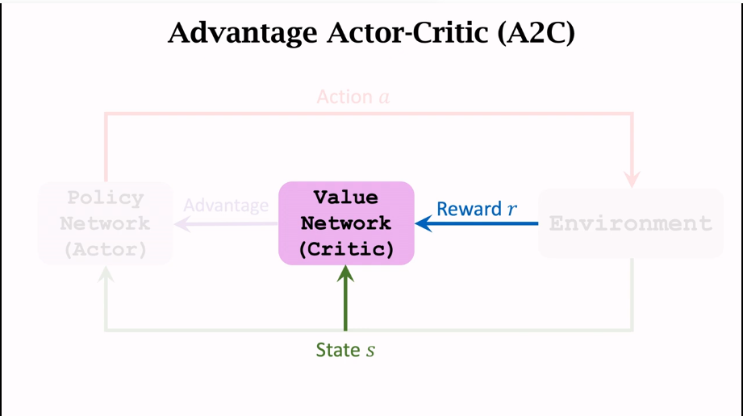

---

#### REINFORCE versus A2C

*A2C的价值网络用于评价actor的表现，REINFORCE用的价值网络仅仅是baseline，不会评价动作好坏，仅仅用于降低随机梯度的方差*

加入multi-step方法的A2C:

TD target:

$y_t=\sum_{i=0}^{m-1} \gamma^i \cdot r_{t+i}+\gamma^m \cdot v\left(s_{t+m} ; \mathbf{w}\right)$

与one-step的A2C的区别只有$y_t$，其他一致
$$
单步的A2C：\ \ \ \ \ y_t=r_t+\gamma \cdot v(s_{t+1};w)  \\
\uparrow 只使用单步奖励\\
多步的A2C：\ \ \ \ \ \ \ y_t=\sum_{i=0}^{m-1} \gamma^i \cdot r_{t+i}+\gamma^m \cdot v\left(s_{t+m} ; \mathbf{w}\right)\\
\downarrow 使用所有奖励\\
REINFORCE：\ \ \ \ \ \ \ y_t=u_t=\sum_{i=t}^n\gamma^{i-t}\cdot r_i
$$
A2C与REINFORCE的区别在于前者使用的回报部分来自于真实观测，部分来自于价值网络的估计，后者完全来自于真实的奖励，**使用所有奖励消除掉了$\gamma^m \cdot v(s_{t+m};w)$的原因在于这种思想就是REINFORCE的思想，$y_t$的本质就在于给出一个接近于$s_t$真实值的一个估计，如果已经可以获得真实值就不需要估计**

---

#### Discrete VS Continuous Control

将DQN用于连续动作可以考虑做离散化，网格化，动作的数量就对应网格点的数量

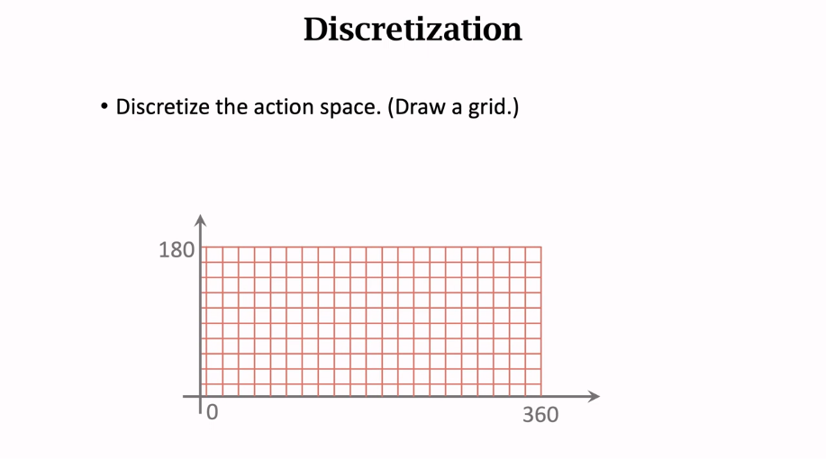

缺陷：当动作的维度d很大时，网格法得到的动作数量会指数增长，造成维度灾难

- 当动作维度较小时可采用网格法
- 当动作维度大时采用：
  1. Deterministic policy network (确定策略网络)
  2. Stochastic policy network (随机策略网络)

---

#### Deterministic Policy Gradient (DPG)

DPG是Actor-Critic方法

策略网络：$a=\pi(s;\theta)$，输出的动作a是确定性的动作(实数或向量)

价值网络：$q(s,a;w)$

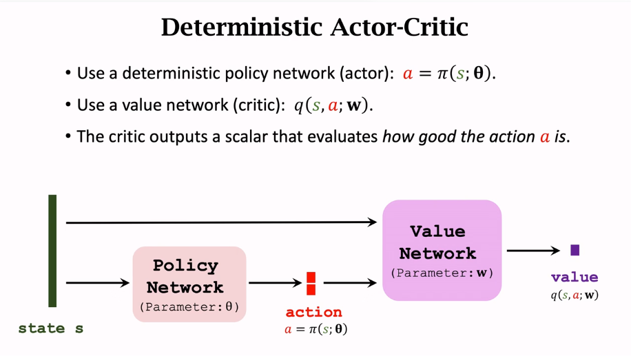

如何更新策略网络的步骤：

目的：训练策略网络以做出价值网络认为高价值的动作

DPG：$\mathbf{g}=\frac{\partial q(s, \pi(s ; \boldsymbol{\theta}) ; \mathbf{w})}{\partial \boldsymbol{\theta}}=\frac{\partial a}{\partial \boldsymbol{\theta}} \cdot \frac{\partial q(s, a ; \mathbf{w})}{\partial a}$ 

梯度上升：$\boldsymbol{\theta} \leftarrow \boldsymbol{\theta}+\beta \cdot \mathbf{g}$

如何更新价值网络的步骤：

1. 一个$transition(s_t,a_t,r_t,s_{t+1})$
2. 价值网络估计：$q_t=q(s_t,a_t;w)$
3. 价值网络对t+1时刻进行预测：$q_{t+1}=q\left(s_{t+1}, a_{t+1}^{\prime} ; \mathbf{w}\right)$, 有 $a_{t+1}^{\prime}=\pi\left(s_{t+1} ; \boldsymbol{\theta}\right), a_{t+1}^,$只是随机抽取，并没有真实发生
4. TD error：$\delta_t=q_t-\left(r_t+\gamma \cdot q_{t+1}\right)$
5. 更新： $\mathbf{w} \leftarrow \mathbf{w}-\alpha \cdot \delta_t \cdot \frac{\partial q\left(s_t, a_t ; \mathbf{w}\right)}{\partial \mathbf{w}}$

TD error采用同一个网络得到$q_t和q_{t+1}$，这种自举的方式会导致低估或者高估，用另一个网络估计TD target：$r_t+\gamma \cdot q_{t+1}$能够取得更好的结果，因此得到：

$q_t=q\left(s_t, a_t ; \mathbf{w}\right)$

$q_{t+1}=q\left(s_{t+1}, a_{t+1}^{\prime} ; \mathbf{w}^{-}\right)$，有 $a_{t+1}^{\prime}=\pi\left(s_{t+1} ; \boldsymbol{\theta}^{-}\right)$

即TD target完全由target网络得到

如何更新target网络：

$\mathbf{w}^{-} \leftarrow \tau \cdot \mathbf{w}+(1-\tau) \cdot \mathbf{w}^{-}$
$\boldsymbol{\theta}^{-} \leftarrow \tau \cdot \boldsymbol{\theta}+(1-\tau) \cdot \boldsymbol{\theta}^{-}  \ \ \ \ \ \  \tau\in(0,1)$       

因为target网络使用了策略网络和价值网络的参数，因此还是会涉及到自举(bootstrapping)

**随机策略与确定策略的不同：**

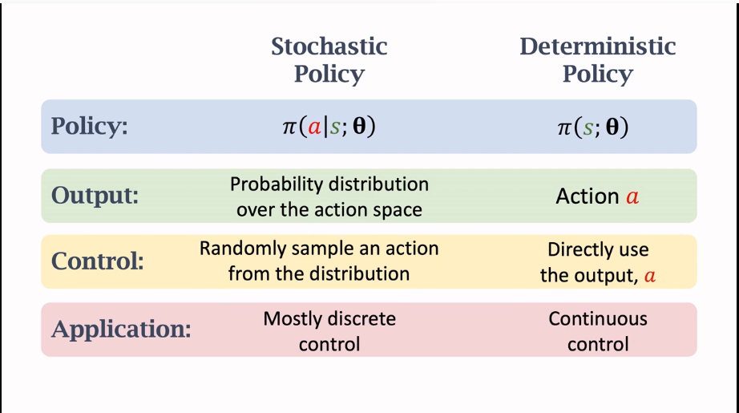

---

#### Stochastic Policy for Continuous Control

*随机策略梯度与确定策略梯度的不同在于前者是获得动作的概率分布通过随机采样的方式获得动作，后者是直接输出确定动作*

纠正问题：

>视频原文说$\mu$(mean)和$\sigma$(std)是状态s的函数的参数，感觉是错的，因为这样不好理解公式，本身策略函数就是在一个状态下选取a的函数，a才是函数的随机变量，因此提出纠正：
>
>基于公式$\pi(a \mid s)=\frac{1}{\sqrt{6.28} \sigma} \cdot \exp \left(-\frac{(a-\mu)^2}{2 \sigma^2}\right)$可以知道在状态s下选取动作a的策略函数，因此是$\mu$和$\sigma$是关于变量a的参数，使用(a|s)进行表述更加准确，因为是在不同状态下选取a

动作a属于正态分布：

- 针对动作维度为1：$\pi(a \mid s)=\frac{1}{\sqrt{6.28} \sigma} \cdot \exp \left(-\frac{(a-\mu)^2}{2 \sigma^2}\right)$
- 针对动作维度不为1，假设动作$\vec{a}中变量是独立的$：$\pi(\vec{a} \mid s)=\prod_{i=1}^d \frac{1}{\sqrt{6.28} \sigma_i} \cdot \exp \left(-\frac{\left(a_i-\mu_i\right)^2}{2 \sigma_i^2}\right)$

需要解决：$\mu_i与\sigma_i$未知的问题

采用神经网络$\mu(a|s;\theta^\mu)$近似$\vec{\mu}(a|s)$,但不使用神经网络近似$\vec{\sigma}(a|s)$，因为效果不好，更好的做法是近似$\rho_i=ln\sigma_i^2$，采用神经网络$\rho(a|s;\theta^\rho)$近似$\vec{\rho}$

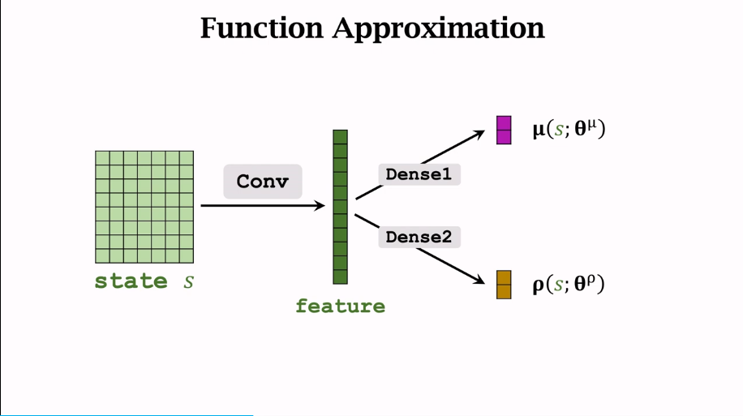

步骤：

- 观测到一个状态s
- 使用神经网络$\mu(a|s;\theta^ \mu)和\rho(a|s;\theta^\rho)$分别近似均值$\vec{\hat{\mu}}$和方差$\vec{\hat\rho}$
- 计算$\hat{\sigma}_i^2=\exp \left(\hat{\rho}_i\right)$
- 对$\vec a$中的$a_i$进行随机抽样，$a_i \sim \mathcal{N}\left(\hat{\mu}_i, \hat{\sigma}_i^2\right)$, for all $i=1, \cdots, d$

训练策略网络的方法(下面两个方法结合都是为了获得随机梯度进行网络参数更新)：

1. 辅助网络(用于计算梯度，训练网络)
2. 策略梯度方法：(用于计算$Q_\pi(s,a)$)
   - REINFORCE
   - Actor-Critic

随机策略梯度：

$\mathbf{g}(a)=\frac{\partial \ln \pi(a \mid s ; \boldsymbol{\theta})}{\partial \boldsymbol{\theta}} \cdot Q_\pi(s, a)$

策略网络：

$\pi\left(\mathbf{a} \mid s ; \boldsymbol{\theta}^\mu, \boldsymbol{\theta}^\rho\right)=\prod_{i=1}^d \frac{1}{\sqrt{6.28} \sigma_i} \cdot \exp \left(-\frac{\left(a_i-\mu_i\right)^2}{2 \sigma_i^2}\right)$

策略网络的自然对数：

$\begin{aligned} \ln \pi\left(\mathbf{a} \mid s ; \boldsymbol{\theta}^\mu, \boldsymbol{\theta}^\rho\right) &=\sum_{i=1}^d\left[-\ln \sigma_i-\frac{\left(a_i-\mu_i\right)^2}{2 \sigma_i^2}\right]+\text { const } \\ &=\sum_{i=1}^d\left[-\frac{\rho_i}{2}-\frac{\left(a_i-\mu_i\right)^2}{2 \cdot \exp \left(\rho_i\right)}\right]+\text { const. } \end{aligned}$

辅助网络：$f(s, \mathbf{a} ; \boldsymbol{\theta})=\sum_{i=1}^d\left[-\frac{\rho_i}{2}-\frac{\left(a_i-\mu_i\right)^2}{2 \cdot \exp \left(\rho_i\right)}\right]$    $\theta=(\theta^\mu,\theta^\rho)$

辅助网络梯度反向传播：

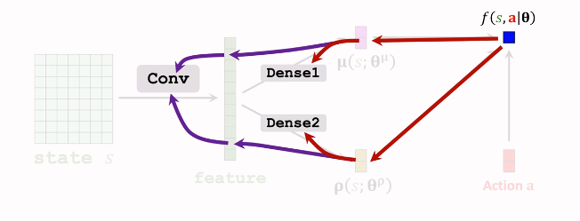

通过辅助神经网络的方法建立了三个神经网络：$\mu(s;\theta^\mu),\rho(s;\theta^\rho)和f(s,a;\theta)$

- $\mu(s;\theta^\mu)和\rho(s;\theta^\rho)$用于控制智能体
- $f(s,a;\theta)$用于辅助训练，$\frac{\partial f}{\partial \theta}$用于梯度的反向传播

因为$f(s, \mathrm{a} ; \boldsymbol{\theta})=\ln \pi(\mathrm{a} \mid s ; \boldsymbol{\theta})+\mathrm{const}$求梯度得到的结果与$ln\pi(a|s;\theta)$得到的结果相同，因此

$\mathbf{g}(\mathbf{a})=\frac{\partial f(s, \mathbf{a} ; \boldsymbol{\theta})}{\partial \boldsymbol{\theta}} \cdot Q_\pi(s, \mathbf{a})$

$Q_\pi(s,a)$通过REINFORCE方法或者Actor-Critic方法获得，Actor-Critic方法需要添加价值网络$q(s,a;w)$，利用TD方法训练价值网络

可以采用baseline的方式提升效果，也可以采用过去提到的提升效果的方法
